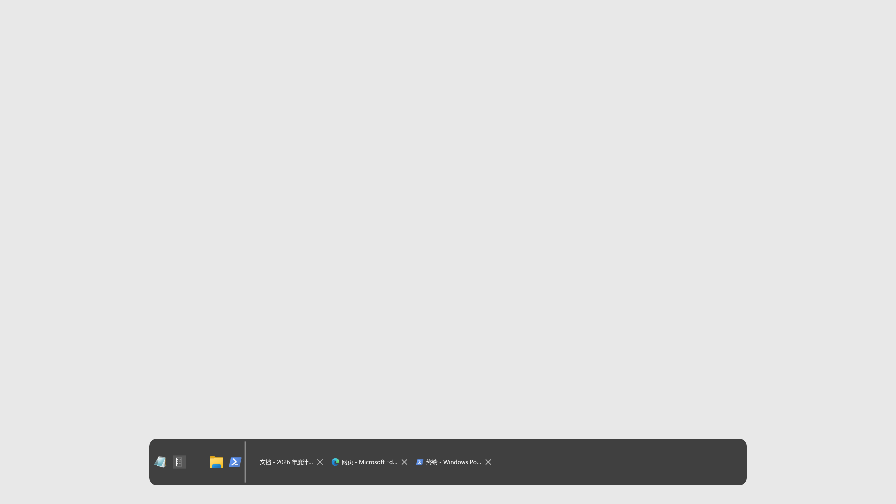
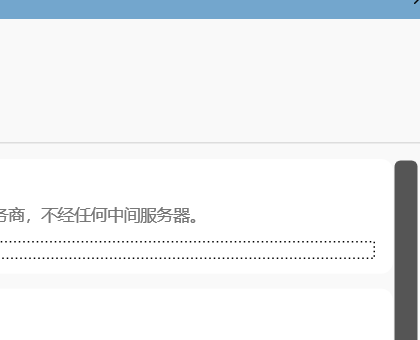
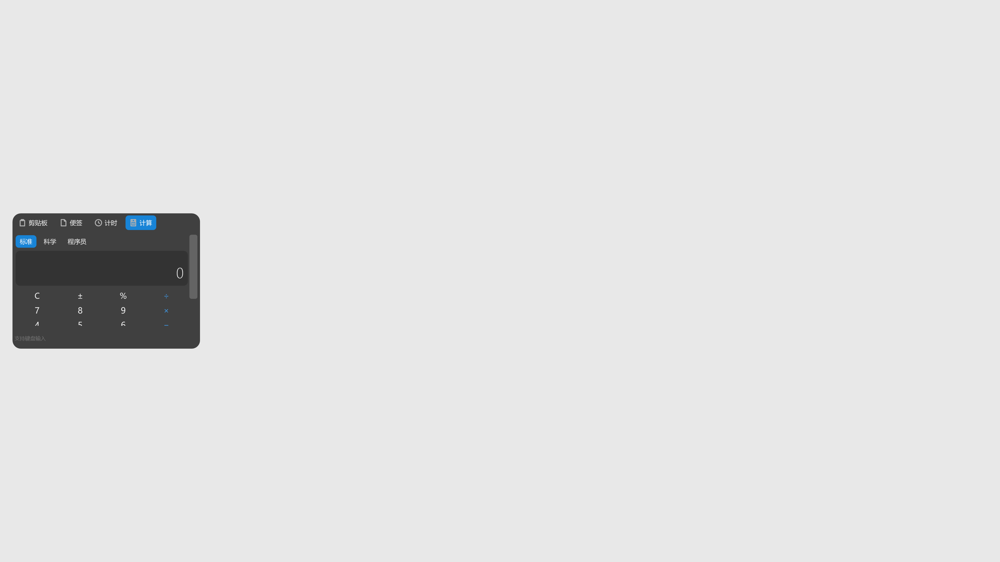
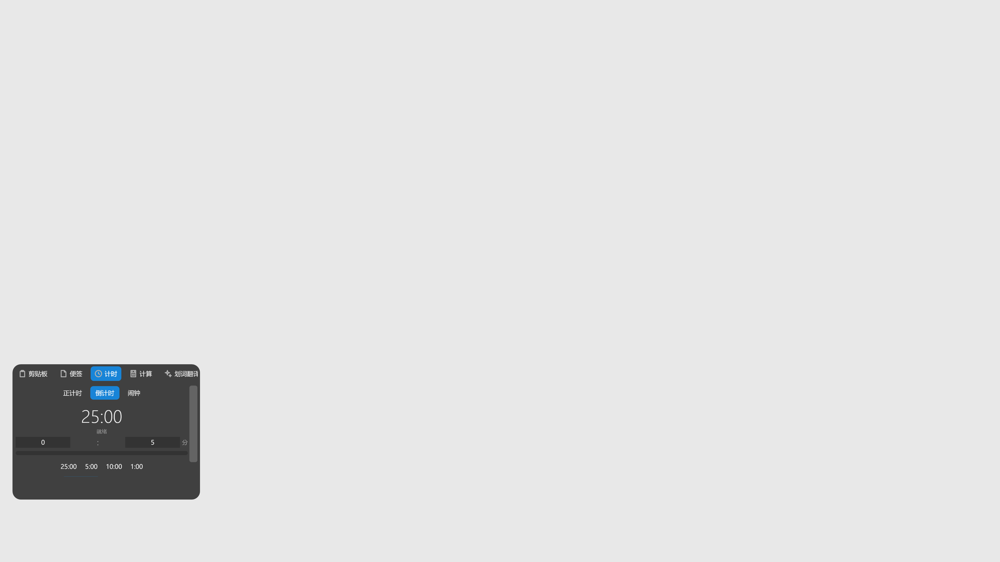
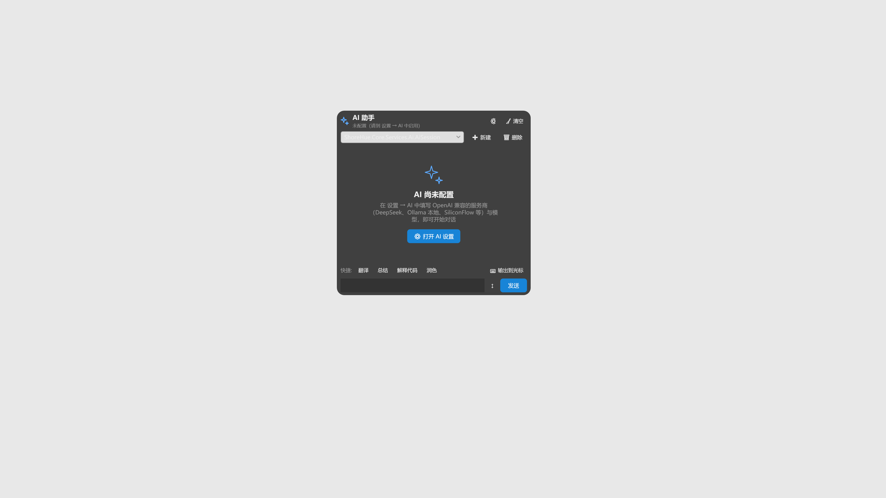
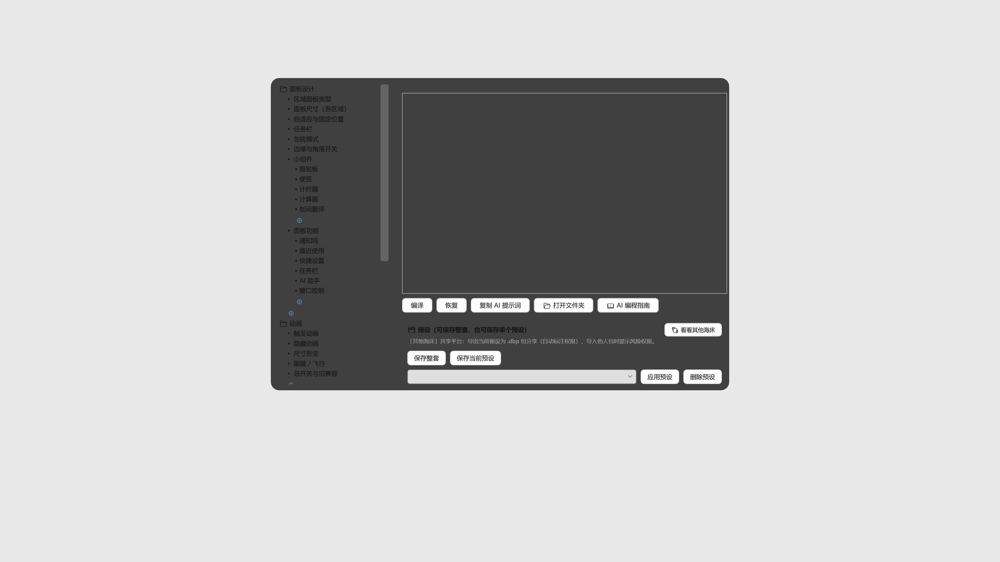

# ShoreHue 海岸线

<p align="center">
  
</p>

<p align="center">
  <b>Dynamic Island-style edge panel & programmable exoskeleton for Windows</b><br/>
  一款 Windows 桌面边缘面板工具，更是一层「可编程外骨骼」：常用功能收纳到屏幕边缘，鼠标滑过即呼出，用完自动隐去；
  内置 AI 编程（海床）+ 在线市场，让你和 AI 一起按需「长出」新功能——小组件、面板、状态栏显示项、动画，全部可自定义。

<p align="center">
  <a href="https://github.com/timecolors/ShoreHue/releases">GitHub Releases</a> ·
  <a href="https://apps.microsoft.com/detail/9PBR9CCTQXXN">Microsoft Store</a> ·
  <a href="docs/PRIVACY.md">隐私政策 Privacy Policy</a>
</p>

---

## 功能特性 / Features

### 边缘任务栏 / Edge Taskbar
- 在屏幕边缘提供快捷方式与运行中的窗口，支持**拖拽排序**、**关闭窗口**、**拖入快捷方式**
- Shortcuts and running windows at the screen edge, with drag-and-drop ordering, window close, and drag-to-pin.

### 应用辅助 / App Assistant
- 与 Windows 应用联动：**媒体控制**（QQ 音乐等）、**窗口镜像 / 窗口嵌入（画中画）**、**本地视频播放**
- Works hand-in-hand with Windows apps: media control (QQ Music, etc.), window mirroring / embedding (picture-in-picture), and local video playback.

### 小组件 / Widgets
- **剪贴板历史**、**便签**、**计时器 / 倒计时**、**标准 / 科学 / 程序员计算器**
- Clipboard history, notes, countdown timer, and standard / scientific / programmer calculator.
- **自定义小组件**：用 C# 编写自己的小组件插件（内置编辑器与插件库），安装后自动出现在小组件面板
- **Custom widgets**: write your own C# widget plugins (built-in editor & marketplace), they appear in the widget panel automatically.

### 快捷开关 / Quick Toggles
- **音量与亮度**、**蓝牙**、**Wi-Fi**、**移动热点**、**省电模式**、快速打开 Windows 设置
- Volume & brightness, Bluetooth, Wi-Fi, mobile hotspot, battery saver, and quick access to Windows Settings.

### AI 助手 / AI Assistant
- 左边缘中间区域默认呼出 **AI 聊天面板**：流式对话、Markdown 渲染、快捷指令（翻译/总结/解释代码/润色）、历史记忆
- 在设置 → AI 中填写 **OpenAI 兼容** 服务商（DeepSeek / OpenAI / SiliconFlow / Ollama 本地 / OpenRouter / Moonshot / 智谱 / Groq…）与模型，**API Key 仅保存在本机**，请求直连你选择的模型服务商，无账号、无中间服务器
- AI Assistant panel on the left-center edge: streaming chat, Markdown, quick presets, and history. Bring your own OpenAI-compatible provider & API key — stored locally only.

### 通知坞与最近使用 / Notification Dock & Recent Items
- 聚合系统通知；一键打开最近使用的程序、文件与网页
- Aggregate system notifications; reopen recently used apps, files, and web pages in one click.

### 可配置面板 / Configurable Panels
- 屏幕上下左右与四角可**分别配置不同面板**，支持**跟随鼠标 / 固定贴边**两种模式
- Each edge and corner can show a different panel, with follow-mouse or fixed-edge modes.
- 动画顺滑、自适应尺寸、多显示器支持
- Smooth animations, adaptive sizing, and multi-monitor support.
- **设置页按作用对象分类**：常规 / 区域 / 面板 / 动画 / AI / 海床，任务栏与小组件统一归入面板设置
- **左侧交互竖条**：主图标区域改为整条热区——右键菜单按当前面板提供专属操作（显示桌面、清空运行中窗口、直达海床/AI 设置等），支持拖入快捷方式/固定窗口/删除；宽度可拖调
- Settings are grouped by scope (General / Regions / Panels / Animation / AI / Seabed); the left icon area is now a full-height interaction bar with per-panel right-click actions and drag-to-pin support.

### 风格适配 Windows / Windows-Native Styling
- **Win11 风格适配**：Mica 毛玻璃背景、原生圆角、深色标题栏，与系统外观融为一体
- Windows 11 native styling: Mica backdrop, native rounded corners, and dark title bar that blend with the OS.

### 动画设置 / Animation Settings
- **触发 / 隐藏动画分开设置**：滑入滑出、淡入淡出、缩放、弹性（回弹），每种带独立时长与特化参数（缩放比例 / 振荡次数 / 弹性强度）
- Trigger and hide animations are configured separately: slide, fade, zoom, and elastic — each with its own duration and specialized parameters (zoom ratio, oscillations, springiness).
- 面板从**对应边**滑入滑出（左边缘从左侧、底部从下方），动画时长与缓动全部可调
- Panels slide in/out from their corresponding edge (left edge slides from the left, bottom from below); duration and easing are fully adjustable.
- **16 个区域可独立设置触发/隐藏动画**：每个边缘与四角使用自己的动画类型与时长，也可继承全局


  ### 界面字号 / UI Font Scale
  - 设置 → 面板 → 外观：全局字号缩放滑块（75%~150%），所有界面即时生效
  - Global UI font scale (75%–150%) in Panel settings, applied across the whole UI instantly.
### 编程模式（海床）/ Seabed (Programming Mode)
- **配置即代码**：整个设置模型以配置树呈现，每个节点可生成/编辑可执行 C# 配置代码，逐字段带中文注释
- **单预设闭环**：保存当前节点 → 应用时编译执行写回生效 → 被覆盖的内置设置自动变灰，两击解除单处覆盖
- **整套预设**：全量配置快照保存/应用/删除；被预设覆盖的设置页、海床树、预设列表三处联动标记
- **功能模板**：计时器、计算器、划词翻译、剪贴板、便签等小组件模板 + 通知坞/最近使用/快捷设置等面板模板，保存为变体后分配到任意区域
- **复制 AI 提示词**：描述需求 → AI 生成 C# → 编译 → 应用
  - **状态栏插件**：AI 生成实现 `IStatusProvider` 的 C#（如 CPU 温度、网速），放入 `seabed\状态栏\` 自动挂载到状态栏
  - **自定义动画**：AI 生成实现 `IAnimation` 的 C#（如弹跳、翻转），放入 `seabed\动画\` 后可在设置中选作呼出/隐藏动画
  - **AI 编程指南**：海床界面内置「AI 编程指南」按钮，打开完整教程（能做什么/不能做什么/各类格式）
  - **打开文件夹**：一键定位当前节点在 seabed 文件夹的位置，AI 产出的文件直接放进去即可生效
- Everything is configurable as C# code — a config tree over the full settings model, presets with visual conflict markers, built-in widget & panel templates, and AI-assisted code generation.

### 在线市场 / Online Marketplace
- 预设与功能包托管在 **GitHub 仓库 + jsDelivr CDN**：浏览、一键下载安装
- 安装时**重新检测权限**（联网/剪贴板/文件/进程等，不信任包内声明）→ 风险权限弹窗确认 → **沙箱编译**拦截危险 API；包随主仓库发布，**CI 自动编译验证**每个包
- Packages are hosted on GitHub (served via jsDelivr CDN): browse and install in one click. Every install re-detects permissions, asks for confirmation, and compiles in a sandbox that blocks dangerous APIs; CI validates every package.

- Each of the 16 regions can use its own show/hide animation type & duration, or inherit the global setting.

> 所有数据仅保存在本机 `%LOCALAPPDATA%\ShoreHue`，不上传云端；完全免费、无广告。
> All data stays on your device — no cloud uploads, no ads, completely free.

---


## 截图 / Screenshots

| 边缘任务栏 | 应用辅助（画中画） |
| --- | --- |
|  |  |

| 小组件 - 计算器 | 小组件 - 计时器 |
| --- | --- |
|  |  |

| AI 助手 | 海床（AI 编程） |
| --- | --- |
|  |  |

---

## 安装 / Installation

### Microsoft Store（推荐）
在 Microsoft Store 搜索 **ShoreHue 海岸线**，或直接访问：
<https://apps.microsoft.com/detail/9PBR9CCTQXXN>

### GitHub Releases
从 [Releases](https://github.com/timecolors/ShoreHue/releases) 下载最新版本。

> 要求：Windows 10 1809（10.0.17763）及以上，x64。商店版与 GitHub 版数据目录统一，可无缝切换。

---

## 快速上手 / Quick Start

1. 启动 ShoreHue 后，它会驻留在系统托盘。
2. 将鼠标移到屏幕边缘或角落，即可呼出对应面板：
   - **上 / 下 / 左 / 右边缘**：任务栏、应用辅助、小组件等（默认按位置分配）
   - **四角**：快捷开关（左上）、最近使用（左下）、通知坞（右下）；右上角不呼出，避免影响关闭窗口
3. 鼠标离开面板后自动隐藏；也可在设置中调整每个区域的面板类型、尺寸与触发行为。

---

## 从源码构建 / Build from Source

前置要求：Windows 10/11、[.NET 10 SDK](https://dotnet.microsoft.com/download/dotnet/10.0)。

```bash
git clone https://github.com/timecolors/ShoreHue.git
cd ShoreHue

# 调试运行
dotnet run

# 发布单文件（win-x64）
dotnet publish -c Release -p:PublishProfile=win-x64

# 打包 MSIX（商店版，需要 Windows SDK）
.\packaging\build-msix.ps1

# 单元测试（边缘检测/配置序列化/更新解析）
dotnet test tests/ShoreHue.Tests/ShoreHue.Tests.csproj
```

> 已配置 [GitHub Actions](.github/workflows/build.yml)：每次推送自动构建 + 单元测试 + 冒烟测试；
> 打 `v*` tag 时自动发布 win-x64 单文件、打包 MSIX 并生成 Release 草稿。

---

## 本地化 / Localization

内置中英双语（zh-CN 默认 / en-US），配置项 `Language` 切换，空值跟随系统。
新增字符串与语言详见 [docs/LOCALIZATION.md](docs/LOCALIZATION.md)。

---

## 技术栈 / Tech Stack

- C# / .NET 10 / WPF（Windows Presentation Foundation）
- [NAudio](https://github.com/naudio/NAudio)（音量控制 / 音频设备）
- System.Management（系统信息）
- Microsoft.Data.Sqlite（本地数据）
- MSIX 打包，支持 Microsoft Store 分发

第三方组件完整声明见 [THIRD-PARTY-NOTICES.md](THIRD-PARTY-NOTICES.md)。

---

## 隐私 / Privacy

ShoreHue 不收集、不上传个人数据。所有配置、剪贴板历史、便签等数据仅保存在本机
`%LOCALAPPDATA%\ShoreHue`，卸载商店版时一并清除。详见 [docs/PRIVACY.md](docs/PRIVACY.md)。

---

## 许可证 / License

[MIT](LICENSE) © 2026 TideHue
